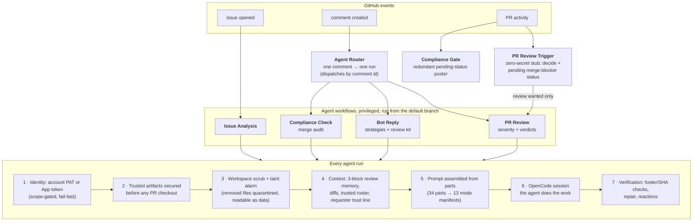

<div align="center">

# Mirrobot Agent

**An AI collaborator for your GitHub repository, powered by [OpenCode](https://opencode.ai), running entirely on GitHub Actions.**

It reads your code, reviews your pull requests, audits merge readiness,
answers questions in your issues, and writes fixes when you ask,
with genuine judgment, in its own voice, on infrastructure you already have.


[![zread](https://img.shields.io/badge/Ask_Zread-_.svg?style=flat&color=00b0aa&labelColor=000000&logo=data%3Aimage%2Fsvg%2Bxml%3Bbase64%2CPHN2ZyB3aWR0aD0iMTYiIGhlaWdodD0iMTYiIHZpZXdCb3g9IjAgMCAxNiAxNiIgZmlsbD0ibm9uZSIgeG1sbnM9Imh0dHA6Ly93d3cudzMub3JnLzIwMDAvc3ZnIj4KPHBhdGggZD0iTTQuOTYxNTYgMS42MDAxSDIuMjQxNTZDMS44ODgxIDEuNjAwMSAxLjYwMTU2IDEuODg2NjQgMS42MDE1NiAyLjI0MDFWNC45NjAxQzEuNjAxNTYgNS4zMTM1NiAxLjg4ODEgNS42MDAxIDIuMjQxNTYgNS42MDAxSDQuOTYxNTZDNS4zMTUwMiA1LjYwMDEgNS42MDE1NiA1LjMxMzU2IDUuNjAxNTYgNC45NjAxVjIuMjQwMUM1LjYwMTU2IDEuODg2NjQgNS4zMTUwMiAxLjYwMDEgNC45NjE1NiAxLjYwMDFaIiBmaWxsPSIjZmZmIi8%2BCjxwYXRoIGQ9Ik00Ljk2MTU2IDEwLjM5OTlIMi4yNDE1NkMxLjg4ODEgMTAuMzk5OSAxLjYwMTU2IDEwLjY4NjQgMS42MDE1NiAxMS4wMzk5VjEzLjc1OTlDMS42MDE1NiAxNC4xMTM0IDEuODg4MSAxNC4zOTk5IDIuMjQxNTYgMTQuMzk5OUg0Ljk2MTU2QzUuMzE1MDIgMTQuMzk5OSA1LjYwMTU2IDE0LjExMzQgNS42MDE1NiAxMy43NTk5VjExLjAzOTlDNS42MDE1NiAxMC42ODY0IDUuMzE1MDIgMTAuMzk5OSA0Ljk2MTU2IDEwLjM5OTlaIiBmaWxsPSIjZmZmIi8%2BCjxwYXRoIGQ9Ik0xMy43NTg0IDEuNjAwMUgxMS4wMzg0QzEwLjY4NSAxLjYwMDEgMTAuMzk4NCAxLjg4NjY0IDEwLjM5ODQgMi4yNDAxVjQuOTYwMUMxMC4zOTg0IDUuMzEzNTYgMTAuNjg1IDUuNjAwMSAxMS4wMzg0IDUuNjAwMUgxMy43NTg0QzE0LjExMTkgNS42MDAxIDE0LjM5ODQgNS4zMTM1NiAxNC4zOTg0IDQuOTYwMVYyLjI0MDFDMTQuMzk4NCAxLjg4NjY0IDE0LjExMTkgMS42MDAxIDEzLjc1ODQgMS42MDAxWiIgZmlsbD0iI2ZmZiIvPgo8cGF0aCBkPSJNNCAxMkwxMiA0TDQgMTJaIiBmaWxsPSIjZmZmIi8%2BCjxwYXRoIGQ9Ik00IDEyTDEyIDQiIHN0cm9rZT0iI2ZmZiIgc3Ryb2tlLXdpZHRoPSIxLjUiIHN0cm9rZS1saW5lY2FwPSJyb3VuZCIvPgo8L3N2Zz4K&logoColor=ffffff)](https://zread.ai/Mirrowel/Mirrobot-agent) [](https://deepwiki.com/Mirrowel/Mirrobot-agent) [](https://mirrowel.github.io/Mirrobot-agent/?bot=Mirrobot-Agent)

The **[Ask Mirrobot](#landing-page--badge)** badge in the row above is this project's own.

[](LICENSE)
[](https://opencode.ai)
[](https://github.com/features/actions)
[](#configuration)

</div>

---

## Contents

- [What you get](#what-you-get)
- [How it works](#how-it-works)
- [Quick start (~10 minutes)](#quick-start-10-minutes)
- [Trigger words & identity](#trigger-words--identity)
- [Configuration](#configuration), every secret and variable
- [Pause switches](#pause-switches)
- [Cross-repo guest mode](#cross-repo-guest-mode-opt-in)
- [The workflows](#the-workflows)
- [Security](#security)
- [Development](#development)
- [Documentation](#documentation)
- [FAQ](#faq)

---

## What you get

| | The agent will... |
|---|---|
| 🔍 **Analyze every new issue** | Assess the problem, hunt duplicates, trace the root cause through your code, suggest a fix and labels |
| 🧠 **Review every pull request** | Severity-graded findings (🔴 🟠 🟡 🔵), inline on the exact lines, with a justified verdict in plain words |
| ✅ **Audit merge readiness** | On `/mirrobot-check`: documentation, consistency, good practices, gating the merge via a real status check |
| 💬 **Answer anywhere** | `@mirrobot-agent` in any issue or PR: questions answered, code investigated, other PRs reviewed on demand |
| 🔧 **Contribute code** | "Fix this" → it branches, implements, self-reviews, and opens a PR, never touching your workflows |
| 🛡️ **Refuse to be exploited** | Injection-hardened, adversarially tested, scrubbed workspaces, least-privilege tokens |

Closer to a colleague than a linter: it reads the whole thread, remembers its own previous reviews, admits uncertainty, argues when you're wrong, and stays quiet when it has nothing to add.

### What a review looks like

> **Verdict: changes requested**: the tracing hook has two blocking problems; the rest is solid and I'd approve once they're addressed.
>
> * `logger.py:42` 🔴 **Critical**: `redact_keys` skips `Authorization` and `x-api-key`, so the "redacted" trace file contains raw credentials
> * `logger.py:88` 🟠 **Major**: the flush happens after the response returns, so a crashed request loses its own trace
> * `README.md` 🟡 **Minor**: new `TRACE_FILE` env var is undocumented
> * `tests/` 🔵 **Info**: no coverage for the new hook; the existing fixtures would take a case easily
>
> *This review was generated by an AI assistant.*

Every finding carries its severity. The verdict always says *why*. Push a fix and the follow-up review sees only the delta, and checks whether its previous feedback was actually addressed.

---

## How it works



**The core security principle: PR content is only ever data.** Privileged workflows always execute the default branch's copy of themselves; a malicious PR cannot redefine the pipeline that reviews it. Untrusted text never touches a shell except through environment variables. Everything the agent auto-loads from a checkout (instruction files, agent configs, skills) survives only when its bytes match a state a trusted branch shipped; otherwise it's removed, logged, and quarantined for the agent to read as data. The details are in [security](docs/security.md); read them before you open this to strangers.

And the platform checks itself: a fixture suite and prompt-rule pins run in CI on every change to `.github/`, so drift shows up as a red build instead of a silent change.

---

## Quick start (~10 minutes)

### 1. Install the platform

Copy `.github/` from this repo into yours, on the default branch. That's the whole platform.

Two optional companions, each enabling one feature:

| Also copy | Enables |
|---|---|
| `decrypt_share_link.py` | Decrypting the agent's encrypted session share links locally (without it, links are captured and masked but not recoverable) |
| `tools/mention-worker/` | Cross-repo guest mode, the agent answering mentions in repos it's not installed in |

### 2. Pick an identity

**Option A: bot account** (recommended): a dedicated user account with a **classic PAT, `public_repo` scope only** (no `workflow` scope; the platform rejects it), invited to the repo as a collaborator with Write.

**Option B, GitHub App**: [create an App](https://docs.github.com/en/apps/creating-github-apps) with **Contents: read · Issues: read/write · Pull requests: read/write**, install it on the repo.

Both work identically downstream; presence of the account token selects account mode automatically.

### 3. Add secrets

`Settings → Secrets and variables → Actions → Secrets`, the minimal set:

| Secret | What |
|---|---|
| `OPENCODE_MODEL` | Main model, `provider/model` format, e.g. `anthropic/claude-sonnet-4` |
| `OPENCODE_CONFIG_JSON` | Your complete [OpenCode config](https://opencode.ai/docs/config), minified to one line: permission profile, providers, API keys, MCP servers, plugins. Start from the committed template: `.github/actions/bot-setup/permissions.example.json` |
| + identity | `ACCOUNT_GH_TOKEN` (account mode), or `BOT_APP_ID` + `BOT_PRIVATE_KEY` (App mode) |

```bash
# minify the template (or your own config) to one line first:
python minify_json_secret.py .github/actions/bot-setup/permissions.example.json > config.min.json

gh secret set OPENCODE_MODEL       -R <owner>/<repo> --body "anthropic/claude-sonnet-4"
gh secret set OPENCODE_CONFIG_JSON -R <owner>/<repo> < config.min.json        # bash/macOS/Linux
gh secret set ACCOUNT_GH_TOKEN     -R <owner>/<repo>   # paste the PAT when prompted
```
```powershell
Get-Content config.min.json | gh secret set OPENCODE_CONFIG_JSON -R <owner>/<repo>   # PowerShell
```

For orientation, a minimal config looks like:

```json
{
  "provider": { "anthropic": { "options": { "apiKey": "sk-ant-..." } } },
  "permission": { "...": "the block from permissions.example.json" }
}
```

Then run **Agent Bootstrap** once (`Actions → Agent Bootstrap → Run workflow`, needs repo write access): it creates every tuning variable with its safe default (never overwrites) and prints the full secrets checklist into the run summary. Full reference with where-to-get-everything: [Configuration](#configuration).

### 4. Gate merges (recommended)

`Settings → Branches` → protect your default branch → require the **`compliance-check`** status. Now nothing merges until the agent's audit passes.

One trap to avoid: do **not** add a "Restrict updates" rule with admin-only bypass; it deadlocks bot merges entirely.

### 5. Say hello

Open an issue, open a PR, or comment `@mirrobot-agent hello`; within about a minute you should see a 👀 reaction, then a reply. The router's run in the Actions tab is the audit trail of every dispatch decision.

---

## Trigger words & identity

Two systems with two different jobs:

**Triggers, what summons the agent.** The default words are `@mirrobot`, `@mirrobot-agent`, `/mirrobot-review`, and `/mirrobot-check`. They all come from one variable. `BOT_TRIGGERS` holds plain names, and each name expands into a mention plus two commands. Concretely, the default value:

```
BOT_TRIGGERS = "mirrobot, mirrobot-agent"
```

makes the agent answer to `@mirrobot` and `@mirrobot-agent`, run a review for `/mirrobot-review` *and* `/mirrobot-agent-review`, and run compliance for `/mirrobot-check` and `/mirrobot-agent-check`. Renaming works the same way: set `BOT_TRIGGERS="acme"` and the bot answers to `@acme`, `/acme-review`, `/acme-check`, and the mirrobot words stop routing (setting the variable replaces the defaults). When the variable is unset, the names come from the bot's own identity, so an account-mode install answers to its account name.

**Identity, who the agent *is*.** When the agent asks "did I write this review?" (loop guards, review attribution, footer verification), it compares against its logins: whatever you put in the `BOT_IDENTITIES` variable, plus (in account mode) the account name it detects live from its token. If neither exists, the stock names apply. "mirrobot" is the agent's *name*, not an identity: a user who happens to be named `mirrobot` is never treated as the agent itself. Bootstrap seeds both variables.

Details: [configuration](docs/configuration.md) · [renaming](docs/customization.md#renaming-the-agent).

---

## Configuration

Full reference with worked examples lives in [docs/configuration.md](docs/configuration.md). Summary:

**Secrets** (`Settings → … → Secrets`): the three above are the minimal set. Optional: `OPENCODE_API_KEY` (provider key when it's not inside your config), `OPENCODE_FAST_MODEL` (global `small_model`, session-title generation), `SHARE_LINK_PUBKEY` (encrypted share links; `python decrypt_share_link.py setup` does everything).

**Variables** (`Settings → … → Variables`):

| Variable | Default | What it tunes |
|---|---|---|
| `AGENT_PAUSED` | `false` | Global kill switch, see [pause switches](#pause-switches) |
| `OPEN_TRIGGERING` | `true` | `false` = on-demand summons limited to collaborators + trusted roster (auto paths stay open) |
| `AGENT_PAUSED_PARTS_JSON` | all `false` | Per-part pause, see [pause switches](#pause-switches) |
| `AGENT_MODELS_JSON` | *(empty template)* | Per-agent models, see [docs](docs/configuration.md#agent_models_json) |
| `BOT_IDENTITIES` | account login / stock names | Who the agent is (self-detection set) |
| `BOT_TRIGGERS` | `mirrobot, mirrobot-agent` | What summons the agent (stems; commands derive) |
| `CONTEXT_LIMITS_JSON` | *(full budget template)* | Context budget: how many comments/reviews/threads the agent reads, lower = smaller prompts. [Details](docs/configuration.md#context_limits_json) |
| `CONTEXT_IGNORE_AUTHORS` | *(empty)* | Logins whose posts never enter agent context |
| `CONTEXT_FILTER_PATTERNS_JSON` | baked AI-noise defaults | Regex patterns dropping matching posts; **replaces** the defaults |
| `TRUSTED_AGENT_USERS` | *(empty)* | Extra friendly users beyond collaborators (collaborators already count) |
| `PREVIOUS_BOT_REVIEWS_COUNT` | `1` | How many of the agent's own newest reviews are *elevated* (unfiltered memory). Older ones still appear, filtered, in the history block |
| `OPENCODE_PLUGINS_JSON` (+`_1`..`_5`) | *(empty)* | Plugin files without committing them, see [docs](docs/configuration.md) |
| `FOREIGN_MENTIONS_ENABLED` / `FOREIGN_MENTIONS_USERS` | `false` / *(empty)* | Cross-repo guest mode, see below |

Notes:

- Model strings are `provider/model`; the provider can be a built-in (when `OPENCODE_API_KEY` supplies its key) or an entry in your `OPENCODE_CONFIG_JSON`.
- The runtime protects the config secret: every credential leaf inside it is masked, and the file (plus materialized plugins) is deleted right after opencode reads it. [Details](docs/security.md#config-and-credential-lifecycle).
- Thread context is filtered before it's allocated: hidden (minimized) content never reaches the agent (its own posts included), and the built-in defaults drop known AI-reviewer noise (rate-limit notices, skip posts) while keeping those tools' substantive reviews. Output from other AI reviewers is verified like anyone else's; none of it is treated as a verdict.

---

## Pause switches

**`AGENT_PAUSED=true`** pauses everything: the router dispatches nothing, the mention poller stays silent, all agent workflows skip with a visible gray "skipped" (manual dispatches included). The two base-branch marker workflows keep running, so open PRs keep their pending merge-blocker status; pausing never makes a PR mergeable.

**`AGENT_PAUSED_PARTS_JSON`** pauses one part at a time:

```json
{ "pr-review": true, "bot-reply": false, "compliance-check": false, "issue-analysis": false }
```

Paused parts skip visibly; the router stops dispatching them; missing keys (or the whole variable) mean not paused; malformed JSON fails the run with a visible error. Typical use: quiet just the issue triage during a label migration, or just the reviewer while you rebase a big stack.

---

## Cross-repo guest mode (opt-in)

The agent can answer **wherever its account is mentioned**: any public repo, even ones it's not installed in. Mentions of a bot *account* become account notifications; an external [Cloudflare worker](tools/mention-worker/README.md) relays them to the `mention-poller` workflow, which re-verifies everything (allowlist, genuine-mention token, reason) before spawning a guest session under strict [guest rules](docs/security.md), read-only by default, authority pinned to the allowlist.

Enable (account mode only): add `notifications` scope to the PAT, set `FOREIGN_MENTIONS_ENABLED=true`, optionally `FOREIGN_MENTIONS_USERS` (who may summon it abroad; collaborators already can), and deploy the worker (~10 minutes, free tier). End-to-end latency is about a minute and a half (the home-repo path in the quick start answers in under a minute, the guest path adds the worker relay). Full story: [docs/workflows/mention-poller.md](docs/workflows/mention-poller.md).

---

## The workflows

| Workflow | Trigger | Runs from | What it does |
|---|---|---|---|
| **Agent Router** | any comment | main | Parses once, dispatches exactly one target by comment id, one visible run per comment, no fan-out |
| **PR Review Trigger** | PR events | **PR's base branch** | Zero-secret stub (no checkout, no secrets): decides if a review is wanted, posts the pending merge-blocker status, dispatches PR Review, declined events dispatch nothing |
| **PR Review** | dispatch only | main | The reviewer: FIRST/FOLLOW-UP protocols, severity-graded findings, verdicts, footer verification and repair |
| **Issue Analysis** | issue opened | main | Duplicate hunt, root cause, labels, suggested fix |
| **Compliance Check** | `/mirrobot-check` | main | End-of-life merge audit; posts the compliance status + report |
| **Compliance Gate** | PR events | **PR's base branch** | Redundant poster of the pending status; goes red rather than letting a transient error make a PR look mergeable |
| **Bot Reply on Mention** | dispatch only | main | The general agent: conversations, investigations, on-demand reviews, contributions |
| **Agent Bootstrap** | dispatch (write access) | main | One-time setup: seeds every variable, prints the secrets checklist; state-silent (logs never reveal state) |
| **Mention Poller** | dispatch only | main | Cross-repo guest mode entry (see [the worker](tools/mention-worker/README.md)) |
| **Scrub Fixture Suite** | `.github/` changes | the branch under test | The batteries: security fixtures + prompt-rule pins + strict YAML validation (run against the pushed branch's own copy) |

**The "Runs from" column is the platform's spine:** everything that *thinks* (agents, prompts, scrub, routing) always executes from `main`, on every PR (the fixture suite is the one deliberate exception: it's CI, and it tests whatever copy it runs on). Only the two zero-secret marker/dispatcher workflows execute from the PR's base branch (a GitHub rule for `pull_request[_target]` triggers), and their downstream dispatches always target `main`. Platform updates land on `main`; your integration branch needs no per-batch sync. The one exception to that: auto-load content (AGENTS.md and friends) evolves **on the integration branch** with the work it describes. The full sync doctrine lives in [design.md](docs/design.md#the-update-doctrine).

Per-workflow docs, triggers, knobs, failure meanings, test recipes: [docs/workflows/](docs/workflows/).

### The life of a pull request

1. **Opened** → stub dispatches PR Review → *first review*: full diff, acknowledgment within its first action, severity-graded findings, a justified verdict
2. **New commits** → (with the `Agent Monitored` label) → *follow-up*: incremental diff only, previous feedback re-verified
3. **Ready to merge** → `/mirrobot-check` → compliance audit → status goes 🟢 (clean, or warnings, read the description) or 🔴 (blocking)
4. **Merge**: ask the agent and it will merge *after* its own safety review and after reading the compliance description, not merely because the status is green

The review-request button works too: on repos with the platform, requesting a review from the agent's identity triggers an instant review (same path as `/mirrobot-review`).

### The strategies behind a reply

Mention the agent and it picks its own approach, loading the matching instruction set on demand: **conversationalist**, **investigator** (evidence-grade codebase exploration), **code reviewer** (full review flow for any PR, `@mirrobot-agent review #42` works from any thread), **code contributor** (branch → implement → self-review → PR), **repository manager** (labels, issues, housekeeping).

---

## Security

Built against real adversarial testing (disguised injection PRs, trojan documentation, malicious agent-config files, symlink escapes, evil merges) and re-verified by CI on every change.

- **No untrusted interpolation**: comment bodies, PR titles, file contents reach shells only as environment variables; a pinned audit proves it
- **Privileged execution from the default branch only**: the only base-branch workflows are zero-secret, no-checkout markers; a tampered copy of them is powerless by construction
- **Workspace scrub, split trust**: auto-loaded files (instruction files, skills, configs) survive only when their bytes match a state a trusted branch shipped at-or-after the fork point; `.github` wiring anchors to main alone; everything else is removed and quarantined, readable as data
- **Least-privilege identity + dying secrets**: scope-gated tokens, credential leaves masked, config and plugins deleted right after boot

The full threat model, defense by defense, with the known residuals: [docs/security.md](docs/security.md).

---

## Development

```text
.github/
├── actions/
│   ├── bot-setup/                    # dual-identity token + config passthrough
│   │   └── permissions.example.json  # → your OPENCODE_CONFIG_JSON secret
│   └── requester-context/            # trust-line context (association + roster)
├── prompts/
│   ├── security-brief.md             # read first in every agent session
│   ├── parts/                        # 34 instruction parts (the prose)
│   └── manifests/                    # 13 mode manifests (the assembly order)
├── scripts/                          # 14 scripts: assembler, scrub, identity
│                                     # config, discussion fetch, roster, review
│                                     # kit, mention gauntlet, router, reactions,
│                                     # share filter, boot cleanup,
│                                     # + the two CI batteries
└── workflows/                        # the 10 workflows above

minify_json_secret.py                 # JSON → single-line secret string
```

**Changing behavior:** find the part (`grep -r .github/prompts/parts/`), edit it, re-pin if the wording is load-bearing, verify locally (Windows: run these from Git Bash or WSL):

```bash
bash .github/scripts/assemble-prompt.sh --verify        # manifests resolve
bash .github/scripts/assemble-prompt.sh --list          # see every mode
bash .github/scripts/assemble-prompt.sh pr-review-first # read a full prompt
bash .github/scripts/prompt-rule-fixtures.sh            # prompt pins green
bash .github/scripts/scrub-fixtures.sh                  # security fixtures green
```

**Contributing:** fork → branch → change → batteries green → PR. Your PR will get the full treatment, automated review and compliance check before merge.

---

## Documentation

- **[Getting started](docs/getting-started.md)**: the install guide in full detail (identity choice, secrets, branch protection, first hello)
- **[Design](docs/design.md)**: the execution map, the life of a PR, the trust model, the update doctrine
- **[Configuration](docs/configuration.md)**: every variable and secret, with examples and interaction rules
- **[Customization](docs/customization.md)**: prompts, the compliance watch-list, permission profile, renaming the agent
- **[Security](docs/security.md)**: the threat model, defense by defense
- **[Workflows](docs/workflows/)**: one page per workflow
- **[ARCHITECTURE.md](ARCHITECTURE.md)** / **[STRUCTURE.md](STRUCTURE.md)**: the code-state mirrors (layers, entry points, file inventory); the docs above carry the principles and guides

### Landing page & badge

Repositories running a Mirrobot deployment can carry the **Ask Mirrobot** badge, linking visitors to the [informational page](https://mirrowel.github.io/Mirrobot-agent/). Two knobs on the badge link:

- [`?bot=`](docs/customization.md#the-informational-page--badge) — your deployment's bot name, so visitors know who to mention back home; comma-separate several if it answers to more than one (`?bot=MyBot,MyBot[bot]`)
- [`&repo=`](docs/customization.md#the-informational-page--badge) — repoints the page's live-activity strip at the linking repository (`&repo=OWNER/REPO`)

The page ships in [`docs/`](docs/) and publishes through the [Excerpts Refresh](.github/workflows/excerpts-refresh.yml) workflow as a Pages artifact; its "field notes" cards are dealt at random from a weekly-harvested pool of the agent's real posts ([harvest knobs](docs/workflows/excerpts-refresh.md#knobs-workflow-env-block)).

---

## FAQ

**Cost?** Public repos: Actions minutes are free; you pay only LLM usage (typically a few dollars/month for an active project). Private repos: 2,000 free minutes/month. Each run prints its own token usage in the step summary; `CONTEXT_LIMITS_JSON` and `AGENT_MODELS_JSON` are the cost knobs.

**Providers?** Anything OpenCode speaks: OpenAI, Anthropic, self-hosted (Ollama, vLLM), proxies, regional providers, configured in `OPENCODE_CONFIG_JSON`.

**Can it commit code?** Yes, when asked (contributor strategy: branch, implement, self-review, open a PR). It never modifies `.github/workflows` (hard-denied at the permission layer). It merges only after its own safety review + a green compliance check.

**Fork PRs?** Fully supported, including reviews; fork heads are fetched explicitly and pinned to the API-recorded SHA.

**What if it's wrong?** It's an AI: review its output critically, correct it in-thread (it reads follow-ups), and improve the parts. The batteries keep your edits from breaking the system silently.

**Multiple bots?** Different App or account per repo, different secrets, or different prompt parts per fork. The platform is the same.

---

## Credits

Built on [OpenCode](https://opencode.ai) · [GitHub Actions](https://github.com/features/actions) · [GitHub Apps](https://docs.github.com/en/apps). MIT License, see [LICENSE](LICENSE).

**Made for the open-source community**: Deploy in ten minutes; you keep your infrastructure and your keys.
