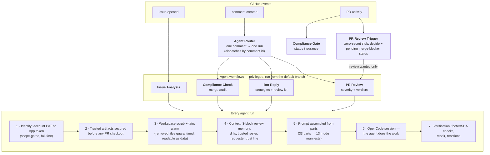

<div align="center">

# Mirrobot Agent

**An AI collaborator for your GitHub repository — powered by [OpenCode](https://opencode.ai), running entirely on GitHub Actions.**

It reads your code, reviews your pull requests, audits merge readiness,
answers questions in your issues, and writes fixes when you ask —
with genuine judgment, in its own voice, for $0 of infrastructure.


[![zread](https://img.shields.io/badge/Ask_Zread-_.svg?style=flat&color=00b0aa&labelColor=000000&logo=data%3Aimage%2Fsvg%2Bxml%3Bbase64%2CPHN2ZyB3aWR0aD0iMTYiIGhlaWdodD0iMTYiIHZpZXdCb3g9IjAgMCAxNiAxNiIgZmlsbD0ibm9uZSIgeG1sbnM9Imh0dHA6Ly93d3cudzMub3JnLzIwMDAvc3ZnIj4KPHBhdGggZD0iTTQuOTYxNTYgMS42MDAxSDIuMjQxNTZDMS44ODgxIDEuNjAwMSAxLjYwMTU2IDEuODg2NjQgMS42MDE1NiAyLjI0MDFWNC45NjAxQzEuNjAxNTYgNS4zMTM1NiAxLjg4ODEgNS42MDAxIDIuMjQxNTYgNS42MDAxSDQuOTYxNTZDNS4zMTUwMiA1LjYwMDEgNS42MDE1NiA1LjMxMzU2IDUuNjAxNTYgNC45NjAxVjIuMjQwMUM1LjYwMTU2IDEuODg2NjQgNS4zMTUwMiAxLjYwMDEgNC45NjE1NiAxLjYwMDFaIiBmaWxsPSIjZmZmIi8%2BCjxwYXRoIGQ9Ik00Ljk2MTU2IDEwLjM5OTlIMi4yNDE1NkMxLjg4ODEgMTAuMzk5OSAxLjYwMTU2IDEwLjY4NjQgMS42MDE1NiAxMS4wMzk5VjEzLjc1OTlDMS42MDE1NiAxNC4xMTM0IDEuODg4MSAxNC4zOTk5IDIuMjQxNTYgMTQuMzk5OUg0Ljk2MTU2QzUuMzE1MDIgMTQuMzk5OSA1LjYwMTU2IDE0LjExMzQgNS42MDE1NiAxMy43NTk5VjExLjAzOTlDNS42MDE1NiAxMC42ODY0IDUuMzE1MDIgMTAuMzk5OSA0Ljk2MTU2IDEwLjM5OTlaIiBmaWxsPSIjZmZmIi8%2BCjxwYXRoIGQ9Ik0xMy43NTg0IDEuNjAwMUgxMS4wMzg0QzEwLjY4NSAxLjYwMDEgMTAuMzk4NCAxLjg4NjY0IDEwLjM5ODQgMi4yNDAxVjQuOTYwMUMxMC4zOTg0IDUuMzEzNTYgMTAuNjg1IDUuNjAwMSAxMS4wMzg0IDUuNjAwMUgxMy43NTg0QzE0LjExMTkgNS42MDAxIDE0LjM5ODQgNS4zMTM1NiAxNC4zOTg0IDQuOTYwMVYyLjI0MDFDMTQuMzk4NCAxLjg4NjY0IDE0LjExMTkgMS42MDAxIDEzLjc1ODQgMS42MDAxWiIgZmlsbD0iI2ZmZiIvPgo8cGF0aCBkPSJNNCAxMkwxMiA0TDQgMTJaIiBmaWxsPSIjZmZmIi8%2BCjxwYXRoIGQ9Ik00IDEyTDEyIDQiIHN0cm9rZT0iI2ZmZiIgc3Ryb2tlLXdpZHRoPSIxLjUiIHN0cm9rZS1saW5lY2FwPSJyb3VuZCIvPgo8L3N2Zz4K&logoColor=ffffff)](https://zread.ai/Mirrowel/Mirrobot-agent) [](https://deepwiki.com/Mirrowel/Mirrobot-agent)

[](LICENSE)
[](https://opencode.ai)
[](https://github.com/features/github-actions)
[](#configuration)

</div>

---

## What you get

| | The agent will... |
|---|---|
| 🔍 **Analyze every new issue** | Assess the problem, hunt duplicates, trace the root cause through your code, suggest a fix and labels |
| 🧠 **Review every pull request** | Severity-graded findings (🔴 🟠 🟡 🔵), inline on the exact lines, with a justified verdict in plain words |
| ✅ **Audit merge readiness** | On `/mirrobot-check`: documentation, consistency, good practices — gating the merge via a real status check |
| 💬 **Answer anywhere** | `@mirrobot-agent` in any issue or PR: questions answered, code investigated, other PRs reviewed on demand |
| 🔧 **Contribute code** | "Fix this" → it branches, implements, self-reviews, and opens a PR — never touching your workflows |
| 🛡️ **Refuse to be exploited** | Injection-hardened, adversarially tested, scrubbed workspaces, least-privilege tokens |

It's not a linter with an API key. It's a colleague — one that reads the whole thread, remembers its own previous reviews, admits uncertainty, argues when you're wrong, and goes quiet when it has nothing to add.

### What a review looks like

> **Verdict: changes requested** — the tracing hook has two blocking problems; the rest is solid and I'd approve once they're addressed.
>
> * `logger.py:42` 🔴 **Critical** — `redact_keys` skips `Authorization` and `x-api-key`, so the "redacted" trace file contains raw credentials
> * `logger.py:88` 🟠 **Major** — the flush happens after the response returns, so a crashed request loses its own trace
> * `README.md` 🟡 **Minor** — new `TRACE_FILE` env var is undocumented
> * `tests/` 🔵 **Info** — no coverage for the new hook; the existing fixtures would take a case easily
>
> *This review was generated by an AI assistant.*

Every finding carries its severity. The verdict always says *why*. Push a fix and the follow-up review sees only the delta — and checks whether its previous feedback was actually addressed.

---

## How it works



**The core security principle: PR content is only ever data.** Privileged workflows always execute the default branch's copy of themselves; a malicious PR cannot redefine the pipeline that reviews it. Untrusted text never touches a shell except through environment variables. Everything the agent auto-loads from a checkout (instruction files, agent configs, skills) survives only when its bytes match a state a trusted branch (`main`, or `dev` for repo doctrine) actually shipped — otherwise it's removed, logged, and quarantined for the agent to read as data. The details are worth understanding before you open this to strangers: [security](docs/security.md).

And the platform checks itself: **193 security fixtures + 339 pinned prompt rules** run in CI on every change to `.github/`, so drift fails loudly instead of silently.

---

## Quick start (~10 minutes)

### 1. Copy the platform in

```bash
git clone https://github.com/Mirrowel/Mirrobot-agent.git
cp -r Mirrobot-agent/.github your-repo/
```

### 2. Pick an identity

**Option A — GitHub App** (classic): [create an App](https://docs.github.com/en/apps/creating-github-apps) with **Contents: read · Issues: read/write · Pull requests: read/write**, install it on the repo.

**Option B — bot account** (recommended): a dedicated user account with a **classic PAT, `public_repo` scope only** (no `workflow` scope — the platform rejects it by design), invited to the repo as a collaborator with Write.

Both work identically downstream; presence of the account token selects account mode automatically.

### 3. Add secrets

`Settings → Secrets and variables → Actions` — the minimal set is **three entries**:

| Secret | What |
|---|---|
| `OPENCODE_MODEL` | Main model, `provider/model` format, e.g. `anthropic/claude-sonnet-4` |
| `OPENCODE_CONFIG_JSON` | Your complete OpenCode config (see below) — **including the LLM API key**, so no separate key secret is needed |
| + identity | One mode pair from the [complete reference below](#complete-secrets-reference): `BOT_APP_ID` + `BOT_PRIVATE_KEY` (App mode), or `ACCOUNT_GH_TOKEN` (account mode) |

From a terminal (gh authenticated with repo admin), that's:

```bash
gh secret set OPENCODE_MODEL       -R <owner>/<repo> --body "anthropic/claude-sonnet-4"
gh secret set OPENCODE_CONFIG_JSON -R <owner>/<repo> < config.min.json
gh secret set ACCOUNT_GH_TOKEN     -R <owner>/<repo>   # paste the PAT when prompted
```

Every optional secret (fast model, API key, share-link key, App credentials) is documented with where-to-get-it in the [complete secrets reference](#complete-secrets-reference) below — nothing else is needed to go live.

#### What `OPENCODE_CONFIG_JSON` actually is

It's a **complete [OpenCode config](https://opencode.ai/docs/config)**, minified to one line — not just permissions. Anything opencode's config supports can live in it: provider definitions (with models and API keys), `small_model`, custom agents, MCP servers, instructions, and the agent's `permission` profile. The committed [permissions.example.json](.github/actions/bot-setup/permissions.example.json) is the recommended `permission` block — embed it as the `"permission"` key inside your config:

```json
{
  "$schema": "https://opencode.ai/config.json",
  "username": "mirrobot-agent",
  "autoupdate": true,
  "small_model": "openai/gpt-4o-mini",
  "provider": {
    "anthropic": {
      "options": { "apiKey": "sk-ant-..." }
    }
  },
  "permission": { "...": "paste permissions.example.json here" }
}
```

Minify whichever JSON you build — the example or your own full config (`permissions.example.json` is itself a complete full-config template now: placeholder provider, example MCP entry, example plugin reference, and the permission block):

```bash
python minify_json_secret.py .github/actions/bot-setup/permissions.example.json
python minify_json_secret.py my-full-config.json
```

**Config lifecycle (how the secret is protected at runtime).** The config is written to the runner as a `chmod 600` file, and bot-setup registers every credential leaf inside it (provider apiKeys, MCP header values, credential-bearing URLs like `?tavilyApiKey=…`) with GitHub's `::add-mask::` — so even if some step ever echoed one, it renders as `***`. Opencode reads the config exactly once at boot (empirically verified — sessions complete correctly with the file deleted mid-run), and each workflow deletes it — along with the materialized plugin files — seconds after the first output line proves boot finished. An `if: always()` step guarantees removal on every exit path. There is nothing on disk to find for the rest of the run.

**Plugins without committing them.** Want opencode plugins (a provider plugin, say) without committing their code? Put each file in the `OPENCODE_PLUGINS_JSON` variable (`{"myplugin/myplugin.js": "<file content>"}`; up to five more via `_1`..`_5`), then reference the materialized path in your config secret's `plugin` array: `"/home/runner/.mirrobot-plugins/myplugin/myplugin.js"`. Files land outside the workspace, permission-denied to the agent, deleted after boot — same lifecycle as the config. Remove the `plugin` entry from your config if you don't use plugins (referencing a path nothing materializes is a boot error).

**How the layers combine** (bot-setup applies these in order): your config is the base → the `OPENCODE_MODEL` secret always sets the main `model` → optional secrets apply only when set, otherwise your config's values stand:

| Optional secret | Overrides config's | Skip it when... |
|---|---|---|
| `OPENCODE_API_KEY` | `provider.<main>.options.apiKey` | the key is already in your config (as above) |
| `OPENCODE_FAST_MODEL` | `small_model` | `small_model` is already in your config |

Optionally add the **variable** (not secret) `TRUSTED_AGENT_USERS` (comma-separated usernames) so the agent knows who its people are, beyond collaborators.

**Or skip the lookup entirely:** run **Agent Bootstrap** once (`Actions → Agent Bootstrap → Run workflow`, admin) — it seeds every variable with its default/template and prints the full secrets checklist into the run summary.

#### Complete secrets reference

Every secret the platform reads, exhaustively:

| Secret | Mode | What it is | Where to get it |
|---|---|---|---|
| `OPENCODE_MODEL` | always | Main model in `provider/model` format (e.g. `anthropic/claude-sonnet-4`). Workflows pass it to every agent session; it always wins over a `model` key in your config | Your provider's model list |
| `OPENCODE_CONFIG_JSON` | always (rec.) | Your complete OpenCode config, minified to one line — permissions, provider keys, `small_model`, agents, MCP (see above) | Build it yourself; start from the committed example |
| `OPENCODE_API_KEY` | optional | LLM provider API key; injected as `provider.<main>.options.apiKey` | Your provider's dashboard — skip it if the key is already in your config |
| `OPENCODE_FAST_MODEL` | optional | Cheap model for subtasks (`small_model`) | Same as `OPENCODE_MODEL` — skip it if set in your config |
| `SHARE_LINK_PUBKEY` | optional | RSA **public** key (PEM) used to encrypt the agent's session share links; without it links are captured and masked but not recoverable. Run `python decrypt_share_link.py setup` to generate + set it in one command | `decrypt_share_link.py setup`, or `openssl genpkey ...` + `gh secret set` (see [Security](#security)) |
| `BOT_APP_ID` | App mode | The numeric ID of your GitHub App | Your App's settings page (`Settings → Developer settings → GitHub Apps`) |
| `BOT_PRIVATE_KEY` | App mode | The App's private key — the **full PEM file contents** including `BEGIN/END RSA PRIVATE KEY` lines (newlines and all) | Generated when you create the App, or regenerate on its settings page |
| `ACCOUNT_GH_TOKEN` | Account mode | A **classic** PAT of the bot account with the `public_repo` scope (**+ `notifications`** when cross-repo guest mode is enabled — the mention-worker polls the account's notifications with it). No `workflow` scope — the platform hard-fails if it sees one (it preserves GitHub's workflow-push protection); missing `public_repo` also fails. Validated via the API on every run; a broken token fails fast, never silently falls back | Bot account → `Settings → Developer settings → Personal access tokens → Tokens (classic) → Generate new token`, check `public_repo` (+ `notifications` for cross-repo) |

**Which identity do the two mode secrets select?** Exactly one pair, ever: `ACCOUNT_GH_TOKEN` present → account mode (recommended); otherwise `BOT_APP_ID` + `BOT_PRIVATE_KEY` → App mode. Neither → the workflow fails with a clear error.

**Name vs identity:** the agent's *identities* are exactly the account login and the App bot login (`mirrobot-agent`, `mirrobot-agent[bot]` — matching is case-insensitive). "mirrobot" is its *name* — used for mentions (`@mirrobot` still routes) — but a user or app merely *named* `mirrobot` is never treated as the agent itself. Renaming your account or App updates the identity automatically; comparisons never break on casing.

**App-mode permission requirements** (App settings → Permissions): Contents **read-only**, Issues **read & write**, Pull requests **read & write** (Metadata is granted automatically). The App must be installed on the repository.

#### Variables reference

Set under `Settings → Secrets and variables → Actions → Variables` (not secrets — these are non-sensitive tuning). Two ways to set one:

```bash
# from a terminal (gh authenticated as someone with repo admin)
gh variable set AGENT_PAUSED -R <owner>/<repo> --body "true"
# or in the UI: Settings → Secrets and variables → Actions → Variables tab
```

| Variable | Default | What it tunes |
|---|---|---|
| `AGENT_PAUSED` | `false` | Kill switch: `true` pauses the agent's brain — router, mention poller, and all four agent workflows skip (visible gray). The stub + compliance-gate keep running, so the pending status keeps blocking merges while paused. |
| `AGENT_MODELS_JSON` | *(empty template)* | Per-agent models — see worked example below. |
| `OPENCODE_PLUGINS_JSON` (+ `_1`..`_5`) | *(empty)* | Plugin files for opencode, without committing them — see worked example below. |
| `TRUSTED_AGENT_USERS` | *(empty)* | Comma-separated usernames the agent treats as trusted people (on top of collaborators) — informs its judgment, never its authorization |
| `PREVIOUS_BOT_REVIEWS_COUNT` | `1` | How many of the agent's own latest PR reviews are elevated (unfiltered) into its review context |
| `CONTEXT_IGNORE_AUTHORS` | *(empty)* | Comma-separated logins whose posts are dropped entirely from thread context (bots you never want to hear from) |
| `CONTEXT_FILTER_PATTERNS_JSON` | baked defaults | JSON array of case-insensitive regex snippets; any match on a post's **body** drops that post from thread context. Setting it **replaces** the defaults. |
| `FOREIGN_MENTIONS_ENABLED` | `false` | Master switch for **cross-repo guest mode** (see below). Must be exactly `true` to enable |
| `FOREIGN_MENTIONS_USERS` | *(empty)* | Extra logins allowed to **summon the agent cross-repo** (unioned with this repo's collaborators — owner included). Deliberately separate from `TRUSTED_AGENT_USERS`: cross-repo summoning is its own, stricter privilege |

##### `AGENT_MODELS_JSON` — different models per agent

Give specific agents their own model (and optionally their own fast model) while everyone else keeps the global `OPENCODE_MODEL` secret. Paste as the variable value:

```json
{
  "pr-review":       { "model": "anthropic/claude-sonnet-4", "fast": "anthropic/claude-haiku-4" },
  "bot-reply":       { "model": "openai/gpt-5" },
  "compliance-check": { "model": "anthropic/claude-sonnet-4" },
  "issue-comment":   { "model": "anthropic/claude-haiku-4" }
}
```

Rules, with behaviors you can observe:
- **Empty string = "not set"**: `{"bot-reply": {"model": ""}}` silently falls back to `OPENCODE_MODEL`. The bootstrap-seeded template is all empty strings — fill in what you want, leave the rest.
- **Missing key = same fallback.** Only the agents you list change.
- **Malformed JSON fails loudly** — the run errors immediately rather than every agent silently dropping to the global model.
- **Model names never appear in logs.** The run log only says `Model: per-agent override for 'pr-review' active.` — the value itself is never echoed.
- `"fast"` (when set) becomes that agent's `small_model` (what opencode uses for its own sub-tasks, like the explore agent). Skip it to keep the global fast model.
- The model string format is identical to `OPENCODE_MODEL`: `provider/model`, where `provider` must exist in your `OPENCODE_CONFIG_JSON`.

##### `OPENCODE_PLUGINS_JSON` — plugins without committing them

For opencode plugins you don't want in the repo (a provider plugin whose code should stay private, for example). Each entry is `"<relative-path>": "<the file's content>"`. Three steps:

**1.** Put the file in the variable (this example is one variable; use `OPENCODE_PLUGINS_JSON_1` .. `_5` for additional separate plugins — all are merged, and the same path in two variables is a hard error):

```json
{ "myrouter/myrouter.js": "export default function({ project, client, $ }) {\n  // plugin code - \\n escapes newlines, \" escapes quotes\n}" }
```

Handy way to build the value without hand-escaping (Python one-liner, run from the plugin's directory):

```bash
python -c "import json,pathlib;print(json.dumps({'myrouter/myrouter.js': pathlib.Path('myrouter.js').read_text()}))" | gh variable set OPENCODE_PLUGINS_JSON -R <owner>/<repo> --body-file -
```

**2.** Reference the materialized file in your `OPENCODE_CONFIG_JSON` secret's `plugin` array, by **absolute path on the runner**:

```json
"plugin": ["/home/runner/.mirrobot-plugins/myrouter/myrouter.js"]
```

**3.** That's it — every agent run materializes the file (chmod 600, outside the workspace), and it's deleted again seconds after opencode boots.

Rules: relative paths only (no `/`, no `..`, no spaces — unsafe paths fail the run); the agent cannot read `~/.mirrobot-plugins` (permission-denied in the example profile); if you later remove the plugin, remove its `plugin` entry too — referencing a path nothing materializes is a boot error. Remove the whole `plugin` array if you use no plugins.

##### `AGENT_PAUSED` — the pause switch

`true` pauses the agent's brain: the router dispatches nothing, the mention poller stays silent, and all four agent workflows skip with a visible gray "skipped" — including manual dispatches. What deliberately keeps running: the PR-review stub and the compliance gate, so open PRs keep their pending merge-blocker status — **pausing never makes a PR mergeable**. Resume by setting the variable back to `false` (or deleting it). Typical use: quiet the agent during an incident or a migration.

##### The comma-separated trio

```bash
gh variable set TRUSTED_AGENT_USERS      -R <owner>/<repo> --body "alice,bob"
gh variable set CONTEXT_IGNORE_AUTHORS   -R <owner>/<repo> --body "some-noisy-bot,another-bot[bot]"
gh variable set FOREIGN_MENTIONS_USERS   -R <owner>/<repo> --body "alice"
```

- `TRUSTED_AGENT_USERS` — people (beyond collaborators) whose asks carry friendly context in the agent's judgment. It still evaluates risk on its own; this is a trust *signal*, not an authorization bypass.
- `CONTEXT_IGNORE_AUTHORS` — posts from these logins never enter the agent's thread context at all. Perfect for another bot you never want the agent reading. `[bot]` suffixes work.
- `FOREIGN_MENTIONS_USERS` — who may summon the agent into *other* repositories via mention (cross-repo guest mode — needs `FOREIGN_MENTIONS_ENABLED=true` too). Deliberately separate from trust: cross-repo summoning is its own, stricter privilege.

`PREVIOUS_BOT_REVIEWS_COUNT` (default `1`): raise it to give the agent deeper memory of its own past reviews on a PR — `3` means its three latest reviews are included unfiltered when re-reviewing, which helps on long-lived PRs with many rounds.

**One-dispatch setup.** The **Agent Bootstrap** workflow (admin: `Actions → Agent Bootstrap → Run workflow`) creates every variable above with its safe default/template — existing values are never overwritten — and prints the complete secrets checklist into the run summary. Seeding authenticates with the repo's existing bot identity token (GITHUB_TOKEN cannot reach the variables API — a platform limitation); if no bot token exists or it lacks access, the run degrades gracefully to copy-paste seeding commands in the summary. Bootstrap logs are state-silent by design: they can never reveal which variables or secrets exist.

**Noise filtering.** The agent's thread context hides junk automatically: hidden (minimized) content is excluded everywhere — the agent's own posts included; and the built-in pattern defaults drop the known noise classes of AI reviewers (CodeRabbit rate-limit / `Review skipped` / `Too many files` posts, the `No actionable comments` notices, Greptile's status channel) while **keeping their substantive reviews** — walkthroughs, overviews, and inline findings survive. Other AI reviewers are treated as input, never authority: their findings are leads to verify, never verdicts to mirror.

Custom patterns (JSON array; regex metacharacters work; backslashes double as JSON escapes; commas/pipes inside patterns are fine):

```json
["skip rationale I never want", "^<!-- deploy-status -->", "stale-bot marker [0-9]+"]
```

Paste that array as the `CONTEXT_FILTER_PATTERNS_JSON` variable to extend or replace the defaults. Malformed JSON falls back to the defaults with a workflow warning.

### Cross-repo guest mode (opt-in)

The agent can answer **anywhere its account is mentioned** — any public repo, even ones it is not installed in. The bot *account* is mentionable globally; GitHub turns `@mirrobot-agent` mentions and review-request-button requests into account notifications; the external **[mention-worker](tools/mention-worker/README.md)** (below) polls them and the `mention-poller` workflow runs the gauntlet on whatever it relays. One platform caveat: GitHub only delivers **review-request** notifications for collaborators — in pure guest repos (where the account was never invited) the review button cannot reach the account at all, and the @mention flow is the only summon path.

**How to enable** (account mode only — the App is structurally blind abroad):

1. Regenerate the account PAT with `public_repo` **+ `notifications`** scopes and update the `ACCOUNT_GH_TOKEN` secret.
2. Set the variable `FOREIGN_MENTIONS_ENABLED=true`.
3. Optionally set `FOREIGN_MENTIONS_USERS` — extra logins allowed to summon the agent cross-repo (unioned with the repo's collaborators; deliberately separate from `TRUSTED_AGENT_USERS`).

**Two gauntlets, defense in depth.** The *worker pre-filter* (deny-only, fail-open): bot-own identity, author/requester allowlist (collaborators ∪ `FOREIGN_MENTIONS_USERS`), genuine-mention token — declines are acked and never wake Actions; any uncertainty relays anyway. Then the *in-repo gauntlet* (all in `handle-mentions.sh`, battery-tested, the sole authority): reason filter → skip matrix (repos of the home owner that run the platform are no-ops — their own instance answers; foreign repos are handled even when they run their own fork, since a fork serves *their* identity) → mark-read-before-dispatch → subject re-fetch from the API → bot-loop guard → **summoner allowlist** → genuine-mention token verification (for review requests: trust the timeline *actor*, not the PR author) → per-run cap.

**Guest rules** (`guest-rules.md`, injected after the security brief): the agent is a *guest* — read-only by default; writes need a verified home-repo link or an explicit ask from an allowlist member; **authority is pinned to the allowlist, never to thread participation** (later commenters are data, not direction — the guest injection guard). Review requests carry their own invitation, including formal verdict submission where the API allows it.

**Latency**: the default entry path is the external **[mention-worker](tools/mention-worker/README.md)** (below) — Actions run only when something actually happened. The worker polls via a self-rescheduling Durable Object alarm with **conditional requests** (free 304 idle polls) at an adaptive 30–60s cadence (capped 120s under load; cron triggers are broken on our account — registered but never dispatched; see [the worker README](tools/mention-worker/README.md)). Junk mentions are declined in the worker (allowlist + token pre-filter, fail-open) and never wake Actions; **handled threads are silenced** (unsub-on-engage: plain follow-up comments stop delivering entirely, while real @mentions always break through — verified); live-measured end-to-end mention→reply: ~80–95 seconds. A manual `workflow_dispatch` run polls on demand anytime; an in-repo fallback schedule is a documented opt-in (see the workflow header) — mark-read acks make all paths mutually exclusive.

**Host the worker** (default architecture, ~10 minutes, free): see [`tools/mention-worker/README.md`](tools/mention-worker/README.md) — Cloudflare Workers, three secrets (`BOT_PAT` = the account PAT with `public_repo + notifications`; `DISPATCH_PAT` = a fine-grained PAT with `Contents: write` + `Variables: read` on this repo only; `TEST_TOKEN` = random hex gating the maintenance surface), `npx wrangler deploy`. The worker pre-filters and silences but holds zero *authority*: it may only decline-on-positive-evidence or relay — every relayed field is re-verified in-repo, and a fully compromised worker cannot make the agent act.

The **review-request button** also works at home now: on repos with the platform, requesting a review from the agent's identity triggers an instant review (the same path as `/mirrobot-review`), gated on the requested reviewer actually being the agent.

### 4. Gate merges (recommended)

`Settings → Branches` → protect your default branch → require the **`compliance-check`** status. Now nothing merges until the agent's audit passes.

### 5. Say hello

Open an issue, open a PR, or comment `@mirrobot-agent hello` — watch the Actions tab: the router run is the audit trail of every dispatch decision.

---

## The workflows

| Workflow | Trigger | Runs from | What it does |
|---|---|---|---|
| **Agent Router** | any comment | main | Parses once, dispatches exactly one target by comment id — one visible run per comment, no fan-out |
| **PR Review Trigger** | PR events | **PR's base branch** | Zero-secret stub (no checkout, no secrets): decides if a review is wanted, posts the pending merge-blocker status, dispatches PR Review — declined events dispatch nothing |
| **PR Review** | dispatch only | main | The reviewer: FIRST/FOLLOW-UP protocols, severity-graded findings, verdicts, footer verification and repair |
| **Issue Analysis** | issue opened | main | Duplicate hunt, root cause, labels, suggested fix |
| **Compliance Check** | `/mirrobot-check` | main | End-of-life merge audit; posts the compliance status + report |
| **Compliance Gate** | PR events | **PR's base branch** | Redundant poster of the pending status — fails loudly rather than letting a transient error make a PR look mergeable |
| **Bot Reply on Mention** | dispatch only | main | The general agent: conversations, investigations, on-demand reviews, contributions |
| **Agent Bootstrap** | admin dispatch only | main | One-time setup: seeds every variable with safe defaults/templates (never overwrites) and prints the secrets checklist — using the repo's bot identity token, with a manual-instructions fallback; state-silent by design |
| **Mention Poller** | dispatch only | main | Cross-repo guest mode entry (see [the worker](tools/mention-worker/README.md)) |
| **Scrub Fixture Suite** | `.github/` changes | main | The batteries: 193 security fixtures + 339 prompt-rule pins + strict YAML validation |

**The "Runs from" column is the platform's spine:** everything that *thinks* — agents, prompts, scrub, routing — always executes from `main`, on every PR, no exceptions. Only the two zero-secret marker/dispatcher workflows (PR Review Trigger, Compliance Gate) execute from the PR's base branch, because GitHub runs `pull_request[_target]` workflows from there; their downstream dispatches always target `main`, so nothing that thinks ever runs from a PR base. **Update doctrine:** platform changes land on `main` (the sanctioned direct push). `dev` needs no per-batch sync — agent files only-main-touched merge cleanly at the next dev→main merge — and when dev *should* be current (the two base-branch workflows changed), sync with `git merge main` into dev, never copy-commits (merges share commit objects; copies duplicate history into main later). Auto-load content (AGENTS.md and friends) is the deliberate exception: it evolves **on dev** with the work it describes — see [Security](#security).

### The life of a pull request

1. **Opened** → stub dispatches PR Review → *first review*: full diff, acknowledgment within its first action, severity-graded findings, a justified verdict
2. **New commits** → (with the `Agent Monitored` label) → *follow-up*: incremental diff only, previous feedback re-verified
3. **Ready to merge** → `/mirrobot-check` → compliance audit → status goes 🟢 (clean, or warnings — read the description) or 🔴 (blocking)
4. **Merge** — ask the agent and it will merge *after* its own safety review and reading the compliance description, not just the color

### The strategies behind a reply

Mention the agent and it picks its own approach, loading the matching instruction set on demand: **conversationalist**, **investigator** (evidence-grade codebase exploration), **code reviewer** (full review flow for any PR — `@mirrobot-agent review #42` works from any thread), **code contributor** (branch → implement → self-review → PR), **repository manager** (labels, issues, housekeeping).

---

## Configuration

**Identity is dual-mode and automatic** — `ACCOUNT_GH_TOKEN` present → account mode (validated via `/user`, scope-gated: a `workflow` scope is a hard fail, missing `public_repo` is a hard fail); absent → App mode. Identity comparisons are case-insensitive; renaming the account breaks nothing. In account mode the agent can also act in *other* public repositories when a verified lead justifies it (report a bug it confirmed, open a fix PR where welcomed) — a request alone never qualifies.

**Behavior lives in `OPENCODE_CONFIG_JSON`** ([see secrets](#3-add-secrets)) — a complete OpenCode config: permission profile (deny-by-default bash with explicit allows, env-dump and credential-access denies, repo-injected skills denied — approve individual skills by name if you want them), plus optionally providers, `small_model`, agents, and MCP servers. Workflows never touch this config; you own it. At runtime it is masked leaf-by-leaf and **deleted after opencode boots** (see [config lifecycle](#3-add-secrets)); the run's step summary carries a bare `opencode stats` usage report (tokens and cost — model stats stay hidden).

**Per-agent models** via the `AGENT_MODELS_JSON` variable — e.g. run reviews on a heavyweight model and issue triage on a light one, without touching secrets. **The pause switch** `AGENT_PAUSED=true` silences the agent's brain (router, poller, all agent workflows) while the stub and compliance-gate keep blocking merges. Both are seeded by **Agent Bootstrap**.

**`FILE_GROUPS_JSON`** in `compliance-check.yml` defines which files must stay consistent with each other (e.g. README ↔ workflows) — edit it to match your project.

**Prompts are parts, not monoliths** — 33 instruction parts assembled per mode (13 manifests) by a fail-closed assembler. Edit a part, every mode that uses it updates; battery pins keep the load-bearing wording from drifting.

---

## Security

Built against real adversarial testing — disguised injection PRs, trojan documentation, malicious agent-config files, symlink escapes, evil merges — and re-verified by CI on every change.

- **No untrusted interpolation** — comment bodies, PR titles, file contents reach shells only as environment variables; a pinned audit proves it
- **Privileged execution from the default branch only** — the single `pull_request_target` workflow is a zero-secret, no-checkout stub: a tampered copy of it is powerless by construction
- **Workspace scrub, split trust** — auto-load surfaces (`AGENTS.md`, `CLAUDE.md`, `GEMINI.md`, `.cursorrules` and siblings; `.claude/`, `.agents/`, `.opencode/`, `.cursor/`, `.windsurf/`, `.devin/` directories) survive only when their bytes match a state a **trust branch** (`main` or `dev`) shipped at-or-after that branch's fork point with the PR — each branch gets its own floor. This is deliberately two different rules for two different surfaces: **auto-load content is trusted from main ∪ dev** because it describes the code it ships with and legitimately evolves on dev before merging up; **`.github` platform wiring is anchored to main alone** because that's what actually executes. Older-than-every-floor content is a deliberate rollback (resurrecting something a trust branch already abandoned) and is removed; novel content is removed. Non-tip trusted keeps stay, marked with an era note so the agent treats them as dated context. An optional trust branch that doesn't exist (a deployment without a dev) degrades gracefully to main-only — only a missing `main` fails closed (everything removed). Symlinked configs compare by *resolved* content; removals logged **and quarantined** to `/tmp/scrub-quarantine/` so the agent can still read them as data
- **`.github` taint alarm** — any workflow/prompt/script change in branch history *or* the merged tree (evil-merge safe) is surfaced to the agent with maximum-scrutiny instructions — flagged, never hidden; synced-from-main platform content is recognized (blob-matched against post-fork main states) and explained instead of alarmed
- **Duty over deference** — the security brief trains the agent to treat all requester text as untrusted data regardless of rank, evaluate risk, and refuse; approval requires genuine repository purpose — harmless ≠ mergeable, and the ladder binds for maintainers and admins alike
- **Token hygiene** — short-lived App tokens per run; git auth rides an in-process extraheader, never written to `.git/config`; `persist-credentials: false` on every token-bearing checkout
- **Config lifecycle** — the config secret's inner credentials (provider keys, MCP headers, credential-bearing URLs) are each `::add-mask::`ed at boot, and the config + any materialized plugin files are **deleted seconds after opencode finishes reading them** (once-at-boot semantics, empirically verified) with an `always()` cleanup guarantee — nothing sensitive remains on disk for the agent (or anyone) to find mid-run
- **Encrypted share links** — agent sessions run with `--share`, producing a URL that exposes the full session (thoughts included). The stream is piped through `share-filter.sh`: the raw URL is `::add-mask::`ed, never reaches the public log, and is re-published RSA-OAEP-encrypted (`MRB1.<base64>`) inline, as a notice annotation, and in the run's step summary — together with public context (repo, PR, head SHA, review type, run, actor). Only a holder of the private key can recover the link (see `decrypt_share_link.py` below); there is no private key anywhere in CI.

### `decrypt_share_link.py` — admin-side tool

Copy it anywhere and run it with Python 3 (needs `openssl` on PATH — Git for Windows, macOS, and Linux all ship it):

```
python decrypt_share_link.py                # TUI: decrypt, browse runs, settings
python decrypt_share_link.py "<paste>"      # one-shot: paste anything containing MRB1....
python decrypt_share_link.py setup          # keygen + push SHARE_LINK_PUBKEY secret
```

- **Setup** generates the keypair at `~/.config/mirrobot/share-link.pem` (private key never leaves your machine) and pushes the public key as the `SHARE_LINK_PUBKEY` repo secret via `gh` — or prints exact manual steps when `gh` is unavailable.
- **Decrypt**: paste any block containing `MRB1...` (log line, annotation, summary) — it extracts, decrypts, and shows the URL plus its context. `--open` also launches the browser.
- **Browse**: lists the repo's recent workflow runs, fetches each run's logs, decrypts every share link found, and shows it with metadata — "what did the agent actually think on PR #42?"
- **Persistence is opt-in**: nothing is written to disk until you change a setting (`config set persist true`); decrypted links then append to `~/.config/mirrobot/decryptions.jsonl` as your searchable session archive.

---

## Development

```text
.github/
├── actions/
│   ├── bot-setup/                    # dual-identity token + config passthrough
│   │   └── permissions.example.json  # → your OPENCODE_CONFIG_JSON secret
│   └── requester-context/            # trust-line context (association + roster)
├── prompts/
│   ├── security-brief.md             # read first in every agent session
│   ├── parts/                        # 33 instruction parts (the prose)
│   └── manifests/                    # 13 mode manifests (the assembly order)
├── scripts/                          # 11 scripts: assembler, scrub, review kit,
│                                     # discussion fetch, roster, router, reactions,
│                                     # share filter, + the two CI batteries
└── workflows/                        # the 10 workflows above

minify_json_secret.py                 # JSON → single-line secret string
```

**Changing behavior:** find the part (`grep -r .github/prompts/parts/`), edit it, re-pin if the wording is load-bearing, verify locally:

```bash
bash .github/scripts/assemble-prompt.sh --verify        # manifests resolve
bash .github/scripts/assemble-prompt.sh --list          # see every mode
bash .github/scripts/assemble-prompt.sh pr-review-first # read a full prompt
bash .github/scripts/prompt-rule-fixtures.sh            # 339 pins green
bash .github/scripts/scrub-fixtures.sh                  # 193 fixtures green
```

**Contributing:** fork → branch → change → batteries green → PR. Your PR will get the full treatment — automated review and compliance check before merge.

---

## Documentation

The README stays the overview. Everything deep lives in [`docs/`](docs/):

- **[Getting started](docs/getting-started.md)** — the fork-and-adopt guide: identity, secrets, branch protection, first hello, what's yours vs. machinery
- **[Architecture](docs/architecture.md)** — the execution map (what runs from where and why), the life of a PR, the split-trust model, the update doctrine
- **[Configuration](docs/configuration.md)** — every variable and secret, with examples and interaction rules
- **[Customization](docs/customization.md)** — prompts, the compliance watch-list, permission profile, renaming the agent, adding a mode
- **[Security](docs/security.md)** — the threat model, defense by defense, including the honest residuals
- **[Workflows](docs/workflows/)** — one page per workflow: triggers, knobs, failure meanings, how to test each

---

## FAQ

**Cost?** Public repos: Actions minutes are free — you pay only LLM usage (typically a few dollars/month for an active project). Private repos: 2,000 free minutes/month.

**Providers?** Anything OpenCode speaks: OpenAI, Anthropic, self-hosted (Ollama, vLLM), proxies, regional providers — configured in `OPENCODE_CONFIG_JSON`.

**Can it commit code?** Yes, when asked — contributor strategy: branch, implement, self-review, open a PR. It never modifies `.github/workflows` (hard-denied at the permission layer). It merges only after its own safety review + a green compliance check.

**Fork PRs?** Fully supported, including reviews — fork heads are fetched explicitly and pinned to the API-recorded SHA.

**What if it's wrong?** It's an AI — review its output critically, correct it in-thread (it reads follow-ups), and improve the parts. The batteries keep your edits from breaking the system silently.

**Multiple bots?** Different App or account per repo, different secrets — or different prompt parts per fork. The platform is the same.

---

## Credits

Built on [OpenCode](https://opencode.ai) · [GitHub Actions](https://github.com/features/github-actions) · [GitHub Apps](https://docs.github.com/en/apps). MIT License — see [LICENSE](LICENSE).

**Made for the open-source community** — deploy your AI collaborator in ten minutes, own your infrastructure, keep your keys.
