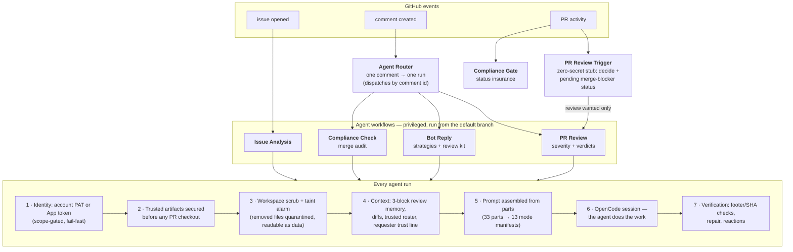

<div align="center">

# Mirrobot Agent

**An AI collaborator for your GitHub repository — powered by [OpenCode](https://opencode.ai), running entirely on GitHub Actions.**

It reads your code, reviews your pull requests, audits merge readiness,
answers questions in your issues, and writes fixes when you ask —
with genuine judgment, in its own voice, for $0 of infrastructure.

[](LICENSE)
[](https://opencode.ai)
[](https://github.com/features/github-actions)
[](#configuration)

</div>

---

## What you get

| | The agent will... |
|---|---|
| 🔍 **Analyze every new issue** | Assess the problem, hunt duplicates, trace the root cause through your code, suggest a fix and labels |
| 🧠 **Review every pull request** | Severity-graded findings (🔴 🟠 🟡 🔵), inline on the exact lines, with a justified verdict in plain words |
| ✅ **Audit merge readiness** | On `/mirrobot-check`: documentation, consistency, good practices — gating the merge via a real status check |
| 💬 **Answer anywhere** | `@mirrobot-agent` in any issue or PR: questions answered, code investigated, other PRs reviewed on demand |
| 🔧 **Contribute code** | "Fix this" → it branches, implements, self-reviews, and opens a PR — never touching your workflows |
| 🛡️ **Refuse to be exploited** | Injection-hardened, adversarially tested, scrubbed workspaces, least-privilege tokens |

It's not a linter with an API key. It's a colleague — one that reads the whole thread, remembers its own previous reviews, admits uncertainty, argues when you're wrong, and goes quiet when it has nothing to add.

### What a review looks like

> **Verdict: changes requested** — the tracing hook has two blocking problems; the rest is solid and I'd approve once they're addressed.
>
> * `logger.py:42` 🔴 **Critical** — `redact_keys` skips `Authorization` and `x-api-key`, so the "redacted" trace file contains raw credentials
> * `logger.py:88` 🟠 **Major** — the flush happens after the response returns, so a crashed request loses its own trace
> * `README.md` 🟡 **Minor** — new `TRACE_FILE` env var is undocumented
> * `tests/` 🔵 **Info** — no coverage for the new hook; the existing fixtures would take a case easily
>
> *This review was generated by an AI assistant.*

Every finding carries its severity. The verdict always says *why*. Push a fix and the follow-up review sees only the delta — and checks whether its previous feedback was actually addressed.

---

## How it works



**The core security principle: PR content is only ever data.** Privileged workflows always execute the default branch's copy of themselves; a malicious PR cannot redefine the pipeline that reviews it. Untrusted text never touches a shell except through environment variables. Everything the agent auto-loads from a checkout (instruction files, agent configs, skills) is kept only if byte-identical to your trusted branches — otherwise removed, logged, and quarantined for the agent to read as data.

And the platform checks itself: **52 security fixtures + 325 pinned prompt rules** run in CI on every change to `.github/`, so drift fails loudly instead of silently.

---

## Quick start (~10 minutes)

### 1. Copy the platform in

```bash
git clone https://github.com/Mirrowel/Mirrobot-agent.git
cp -r Mirrobot-agent/.github your-repo/
```

### 2. Pick an identity

**Option A — GitHub App** (classic): [create an App](https://docs.github.com/en/apps/creating-github-apps) with **Contents: read · Issues: read/write · Pull requests: read/write**, install it on the repo.

**Option B — bot account** (recommended): a dedicated user account with a **classic PAT, `public_repo` scope only** (no `workflow` scope — the platform rejects it by design), invited to the repo as a collaborator with Write.

Both work identically downstream; presence of the account token selects account mode automatically.

### 3. Add secrets

`Settings → Secrets and variables → Actions` — the minimal set is **three entries**:

| Secret | What |
|---|---|
| `OPENCODE_MODEL` | Main model, `provider/model` format, e.g. `anthropic/claude-sonnet-4` |
| `OPENCODE_CONFIG_JSON` | Your complete OpenCode config (see below) — **including the LLM API key**, so no separate key secret is needed |
| + identity | One mode pair from the [complete reference below](#complete-secrets-reference): `BOT_APP_ID` + `BOT_PRIVATE_KEY` (App mode), or `ACCOUNT_GH_TOKEN` (account mode) |

#### What `OPENCODE_CONFIG_JSON` actually is

It's a **complete [OpenCode config](https://opencode.ai/docs/config)**, minified to one line — not just permissions. Anything opencode's config supports can live in it: provider definitions (with models and API keys), `small_model`, custom agents, MCP servers, instructions, and the agent's `permission` profile. The committed [permissions.example.json](.github/actions/bot-setup/permissions.example.json) is the recommended `permission` block — embed it as the `"permission"` key inside your config:

```json
{
  "$schema": "https://opencode.ai/config.json",
  "username": "mirrobot-agent",
  "autoupdate": true,
  "small_model": "openai/gpt-4o-mini",
  "provider": {
    "anthropic": {
      "options": { "apiKey": "sk-ant-..." }
    }
  },
  "permission": { "...": "paste permissions.example.json here" }
}
```

Minify whichever JSON you build — the example or your own full config:

```bash
python minify_json_secret.py .github/actions/bot-setup/permissions.example.json
python minify_json_secret.py my-full-config.json
```

**How the layers combine** (bot-setup applies these in order): your config is the base → the `OPENCODE_MODEL` secret always sets the main `model` → optional secrets apply only when set, otherwise your config's values stand:

| Optional secret | Overrides config's | Skip it when... |
|---|---|---|
| `OPENCODE_API_KEY` | `provider.<main>.options.apiKey` | the key is already in your config (as above) |
| `OPENCODE_FAST_MODEL` | `small_model` | `small_model` is already in your config |

Optionally add the **variable** (not secret) `TRUSTED_AGENT_USERS` (comma-separated usernames) so the agent knows who its people are, beyond collaborators.

#### Complete secrets reference

Every secret the platform reads, exhaustively:

| Secret | Mode | What it is | Where to get it |
|---|---|---|---|
| `OPENCODE_MODEL` | always | Main model in `provider/model` format (e.g. `anthropic/claude-sonnet-4`). Workflows pass it to every agent session; it always wins over a `model` key in your config | Your provider's model list |
| `OPENCODE_CONFIG_JSON` | always (rec.) | Your complete OpenCode config, minified to one line — permissions, provider keys, `small_model`, agents, MCP (see above) | Build it yourself; start from the committed example |
| `OPENCODE_API_KEY` | optional | LLM provider API key; injected as `provider.<main>.options.apiKey` | Your provider's dashboard — skip it if the key is already in your config |
| `OPENCODE_FAST_MODEL` | optional | Cheap model for subtasks (`small_model`) | Same as `OPENCODE_MODEL` — skip it if set in your config |
| `BOT_APP_ID` | App mode | The numeric ID of your GitHub App | Your App's settings page (`Settings → Developer settings → GitHub Apps`) |
| `BOT_PRIVATE_KEY` | App mode | The App's private key — the **full PEM file contents** including `BEGIN/END RSA PRIVATE KEY` lines (newlines and all) | Generated when you create the App, or regenerate on its settings page |
| `ACCOUNT_GH_TOKEN` | Account mode | A **classic** PAT of the bot account with exactly the `public_repo` scope. No `workflow` scope — the platform hard-fails if it sees one (it preserves GitHub's workflow-push protection); missing `public_repo` also fails. Validated via the API on every run; a broken token fails fast, never silently falls back | Bot account → `Settings → Developer settings → Personal access tokens → Tokens (classic) → Generate new token`, check only `public_repo` |

**Which identity do the two mode secrets select?** Exactly one pair, ever: `ACCOUNT_GH_TOKEN` present → account mode (recommended); otherwise `BOT_APP_ID` + `BOT_PRIVATE_KEY` → App mode. Neither → the workflow fails with a clear error.

**Name vs identity:** the agent's *identities* are exactly the account login and the App bot login (`mirrobot-agent`, `mirrobot-agent[bot]` — matching is case-insensitive). "mirrobot" is its *name* — used for mentions (`@mirrobot` still routes) — but a user or app merely *named* `mirrobot` is never treated as the agent itself. Renaming your account or App updates the identity automatically; comparisons never break on casing.

**App-mode permission requirements** (App settings → Permissions): Contents **read-only**, Issues **read & write**, Pull requests **read & write** (Metadata is granted automatically). The App must be installed on the repository.

#### Variables reference

Set under `Settings → Secrets and variables → Actions → Variables` (not secrets — these are non-sensitive tuning):

| Variable | Default | What it tunes |
|---|---|---|
| `TRUSTED_AGENT_USERS` | *(empty)* | Comma-separated usernames the agent treats as trusted people (on top of collaborators) — informs its judgment, never its authorization |
| `PREVIOUS_BOT_REVIEWS_COUNT` | `1` | How many of the agent's own latest PR reviews are elevated (unfiltered) into its review context |
| `CONTEXT_IGNORE_AUTHORS` | *(empty)* | Comma-separated logins whose posts are dropped entirely from thread context (bots you never want to hear from). Example: `some-noisy-bot,another-bot[bot]` |
| `CONTEXT_FILTER_PATTERNS_JSON` | baked defaults | JSON array of case-insensitive regex snippets; any match on a post's **body** drops that post from thread context. Setting it **replaces** the defaults. |

**Noise filtering.** The agent's thread context hides junk automatically: hidden (minimized) content is excluded everywhere — the agent's own posts included; and the built-in pattern defaults drop the known noise classes of AI reviewers (CodeRabbit rate-limit / `Review skipped` / `Too many files` posts, the `No actionable comments` notices, Greptile's status channel) while **keeping their substantive reviews** — walkthroughs, overviews, and inline findings survive. Other AI reviewers are treated as input, never authority: their findings are leads to verify, never verdicts to mirror.

Custom patterns (JSON array; regex metacharacters work; backslashes double as JSON escapes; commas/pipes inside patterns are fine):

```json
["skip rationale I never want", "^<!-- deploy-status -->", "stale-bot marker [0-9]+"]
```

Paste that array as the `CONTEXT_FILTER_PATTERNS_JSON` variable to extend or replace the defaults. Malformed JSON falls back to the defaults with a workflow warning.

### 4. Gate merges (recommended)

`Settings → Branches` → protect your default branch → require the **`compliance-check`** status. Now nothing merges until the agent's audit passes.

### 5. Say hello

Open an issue, open a PR, or comment `@mirrobot-agent hello` — watch the Actions tab: the router run is the audit trail of every dispatch decision.

---

## The workflows

| Workflow | Trigger | What it does |
|---|---|---|
| **Agent Router** | any comment | Parses once, dispatches exactly one target by comment id — one visible run per comment, no fan-out |
| **PR Review Trigger** | PR events | Zero-secret stub (no checkout, no secrets): decides if a review is wanted, posts the pending merge-blocker status, dispatches PR Review — declined events dispatch nothing |
| **PR Review** | dispatch only | The reviewer: FIRST/FOLLOW-UP protocols, severity-graded findings, verdicts, footer verification and repair |
| **Issue Analysis** | issue opened | Duplicate hunt, root cause, labels, suggested fix |
| **Compliance Check** | `/mirrobot-check` | End-of-life merge audit; posts the compliance status + report |
| **Compliance Gate** | PR events | Redundant poster of the pending status — fails loudly rather than letting a transient error make a PR look mergeable |
| **Bot Reply on Mention** | dispatch only | The general agent: conversations, investigations, on-demand reviews, contributions |
| **Scrub Fixture Suite** | `.github/` changes | The batteries: 52 security fixtures + 325 prompt-rule pins + strict YAML validation |

### The life of a pull request

1. **Opened** → stub dispatches PR Review → *first review*: full diff, acknowledgment within its first action, severity-graded findings, a justified verdict
2. **New commits** → (with the `Agent Monitored` label) → *follow-up*: incremental diff only, previous feedback re-verified
3. **Ready to merge** → `/mirrobot-check` → compliance audit → status goes 🟢 (clean, or warnings — read the description) or 🔴 (blocking)
4. **Merge** — ask the agent and it will merge *after* its own safety review and reading the compliance description, not just the color

### The strategies behind a reply

Mention the agent and it picks its own approach, loading the matching instruction set on demand: **conversationalist**, **investigator** (evidence-grade codebase exploration), **code reviewer** (full review flow for any PR — `@mirrobot-agent review #42` works from any thread), **code contributor** (branch → implement → self-review → PR), **repository manager** (labels, issues, housekeeping).

---

## Configuration

**Identity is dual-mode and automatic** — `ACCOUNT_GH_TOKEN` present → account mode (validated via `/user`, scope-gated: a `workflow` scope is a hard fail, missing `public_repo` is a hard fail); absent → App mode. Identity comparisons are case-insensitive; renaming the account breaks nothing. In account mode the agent can also act in *other* public repositories when a verified lead justifies it (report a bug it confirmed, open a fix PR where welcomed) — a request alone never qualifies.

**Behavior lives in `OPENCODE_CONFIG_JSON`** ([see secrets](#3-add-secrets)) — a complete OpenCode config: permission profile (deny-by-default bash with explicit allows, env-dump and credential-access denies, repo-injected skills denied — approve individual skills by name if you want them), plus optionally providers, `small_model`, agents, and MCP servers. Workflows never touch this config; you own it.

**`FILE_GROUPS_JSON`** in `compliance-check.yml` defines which files must stay consistent with each other (e.g. README ↔ workflows) — edit it to match your project.

**Prompts are parts, not monoliths** — 33 instruction parts assembled per mode (13 manifests) by a fail-closed assembler. Edit a part, every mode that uses it updates; battery pins keep the load-bearing wording from drifting.

---

## Security

Built against real adversarial testing — disguised injection PRs, trojan documentation, malicious agent-config files, symlink escapes, evil merges — and re-verified by CI on every change.

- **No untrusted interpolation** — comment bodies, PR titles, file contents reach shells only as environment variables; a pinned audit proves it
- **Privileged execution from the default branch only** — the single `pull_request_target` workflow is a zero-secret, no-checkout stub: a tampered copy of it is powerless by construction
- **Workspace scrub** — auto-load surfaces (`AGENTS.md`, `CLAUDE.md`, `GEMINI.md`, `.cursorrules` and siblings; `.claude/`, `.agents/`, `.opencode/`, `.cursor/`, `.windsurf/`, `.devin/` directories) survive only if byte-identical to trusted branches; symlinked configs compared by *resolved* content; removals logged **and quarantined** to `/tmp/scrub-quarantine/` so the agent can still read them as data
- **`.github` taint alarm** — any workflow/prompt/script change in branch history *or* the merged tree (evil-merge safe) is surfaced to the agent with maximum-scrutiny instructions — flagged, never hidden
- **Duty over deference** — the security brief trains the agent to treat all requester text as untrusted data regardless of rank, evaluate risk, and refuse; approval requires genuine repository purpose — harmless ≠ mergeable, and the ladder binds for maintainers and admins alike
- **Token hygiene** — short-lived App tokens per run; git auth rides an in-process extraheader, never written to `.git/config`; `persist-credentials: false` on every token-bearing checkout

---

## Development

```text
.github/
├── actions/
│   ├── bot-setup/                    # dual-identity token + config passthrough
│   │   └── permissions.example.json  # → your OPENCODE_CONFIG_JSON secret
│   └── requester-context/            # trust-line context (association + roster)
├── prompts/
│   ├── security-brief.md             # read first in every agent session
│   ├── parts/                        # 33 instruction parts (the prose)
│   └── manifests/                    # 13 mode manifests (the assembly order)
├── scripts/                          # 9 scripts: assembler, scrub, review kit,
│                                     # discussion fetch, roster, router, reactions,
│                                     # + the two CI batteries
└── workflows/                        # the 8 workflows above

minify_json_secret.py                 # JSON → single-line secret string
```

**Changing behavior:** find the part (`grep -r .github/prompts/parts/`), edit it, re-pin if the wording is load-bearing, verify locally:

```bash
bash .github/scripts/assemble-prompt.sh --verify        # manifests resolve
bash .github/scripts/assemble-prompt.sh --list          # see every mode
bash .github/scripts/assemble-prompt.sh pr-review-first # read a full prompt
bash .github/scripts/prompt-rule-fixtures.sh            # 325 pins green
bash .github/scripts/scrub-fixtures.sh                  # 52 fixtures green
```

**Contributing:** fork → branch → change → batteries green → PR. Your PR will get the full treatment — automated review and compliance check before merge.

---

## FAQ

**Cost?** Public repos: Actions minutes are free — you pay only LLM usage (typically a few dollars/month for an active project). Private repos: 2,000 free minutes/month.

**Providers?** Anything OpenCode speaks: OpenAI, Anthropic, self-hosted (Ollama, vLLM), proxies, regional providers — configured in `OPENCODE_CONFIG_JSON`.

**Can it commit code?** Yes, when asked — contributor strategy: branch, implement, self-review, open a PR. It never modifies `.github/workflows` (hard-denied at the permission layer). It merges only after its own safety review + a green compliance check.

**Fork PRs?** Fully supported, including reviews — fork heads are fetched explicitly and pinned to the API-recorded SHA.

**What if it's wrong?** It's an AI — review its output critically, correct it in-thread (it reads follow-ups), and improve the parts. The batteries keep your edits from breaking the system silently.

**Multiple bots?** Different App or account per repo, different secrets — or different prompt parts per fork. The platform is the same.

---

## Credits

Built on [OpenCode](https://opencode.ai) · [GitHub Actions](https://github.com/features/github-actions) · [GitHub Apps](https://docs.github.com/en/apps). MIT License — see [LICENSE](LICENSE).

**Made for the open-source community** — deploy your AI collaborator in ten minutes, own your infrastructure, keep your keys.
